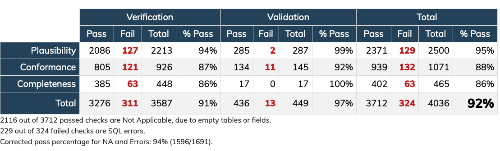

# MIMIC mapping to OMOP
This repository is built using a dockerized template repo for accessing UKE GPU servers. 

- **src/** contains the source code of the project
- **run_process.sh** contains the shell script for running the ETL

## Data Quality Checks


## Google Cloud SDK
```bash
curl https://sdk.cloud.google.com | bash
export PATH="$PATH:~/google-cloud-sdk/bin"
gcloud auth login
```

## mimic2omop flow
```bash
cd src/MIMIC/
cd vocabulary_refresh
python3 vocabulary_refresh.py -s10
python3 vocabulary_refresh.py -s20
python3 vocabulary_refresh.py -s30
cd ../
python3 scripts/run_workflow.py -e conf/full.etlconf -c conf/workflow_ddl.conf
python3 scripts/run_workflow.py -e conf/full.etlconf -c conf/workflow_staging.conf
python3 scripts/run_workflow.py -e conf/full.etlconf -c conf/workflow_etl.conf
python3 scripts/run_workflow.py -e conf/full.etlconf -c conf/workflow_ut.conf
python3 scripts/run_workflow.py -e conf/full.etlconf -c conf/workflow_metrics.conf
python3 scripts/run_workflow.py -e conf/full.etlconf -c conf/workflow_unload.conf
```
## load MIMIC from Nexcloud volume to Google Cloud Bucket
create script file
```bash
nano load_csv_files.sh
```
paste this code in the script file
```bash
#!/bin/bash

# Set your Google Cloud project and dataset
PROJECT_ID="booming-edge-403620"
DATASET="mimiciv_hosp"

# Loop through all CSV files in the current directory
for file in *.csv.gz; do
  # Extract the table name from the filename (assuming filenames are table names)
  table_name=$(basename "$file" .csv.gz)

  # Create the table in BigQuery and upload the data
  bq load --autodetect --source_format=CSV "${PROJECT_ID}:${DATASET}.${table_name}" "$file"
done
```
give the correct permissions to the script 
```bash
chmod +x load_csv_files.sh
```
then run the script
## tmux install
```bash
sudo apt-get update
sudo apt-get install tmux
```
## Download Waveforms data and upload to Google Cloud Bucket
https://physionet.org/content/mimic4wdb/0.1.0/waves/#files-panel

```bash
wget -r -N -c -np https://physionet.org/files/mimic4wdb/0.1.0/ > wget.log 2>&1 &
gsutil cp physionet.org/* gs://shubov-athena/waveforms
```


## Move Results to Google Cloud Bucket
bq ls booming-edge-403620:mimiciv_full_current_cdm

python extract-bq-to-bucket.py

gsutil -m cp -r gs://shubov_mimic-iv/* /data/mimic-iv-2.2/shubov_thesis/OMOP
